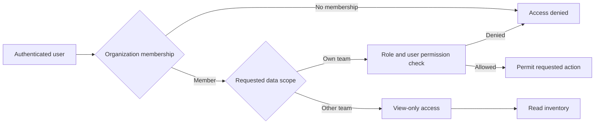
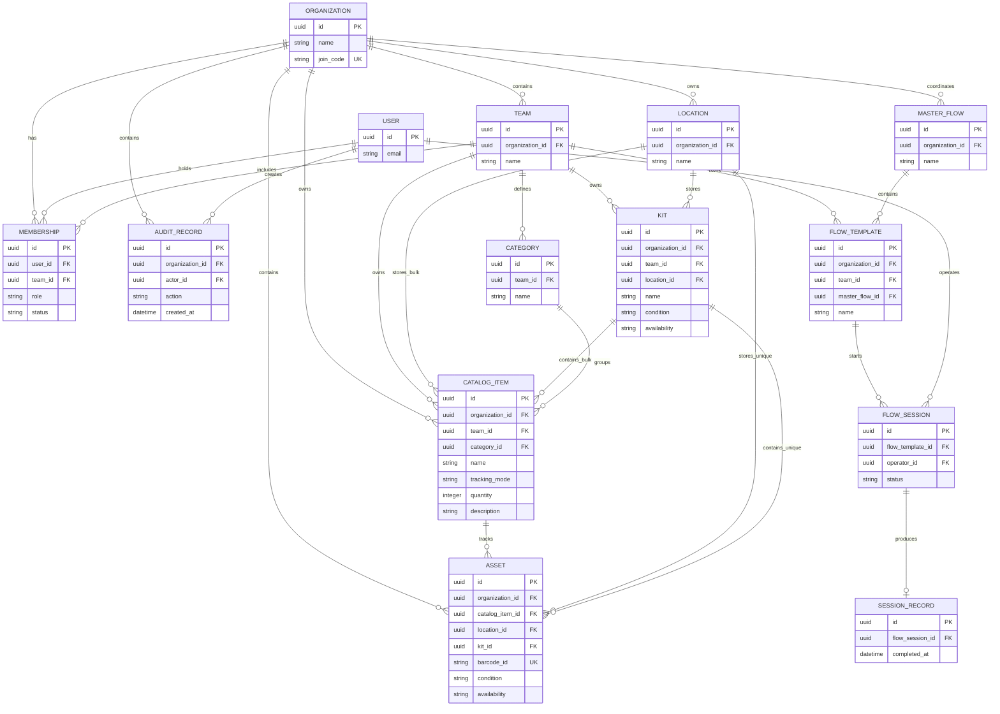
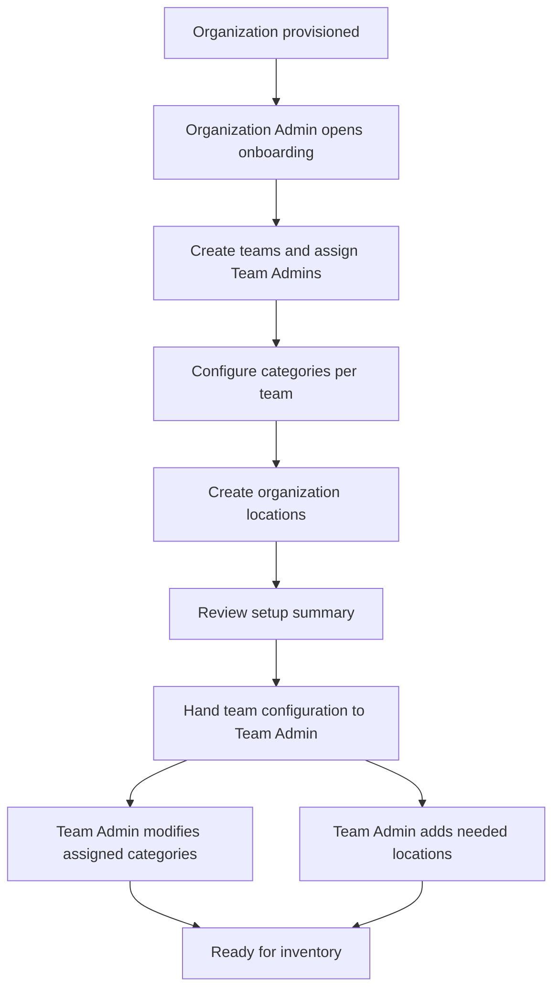
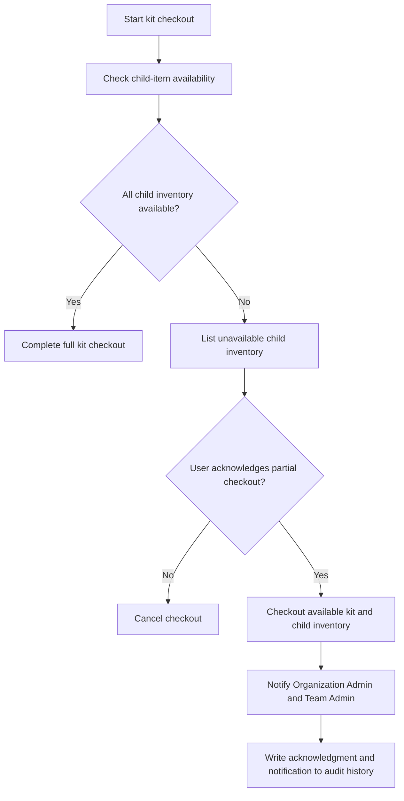
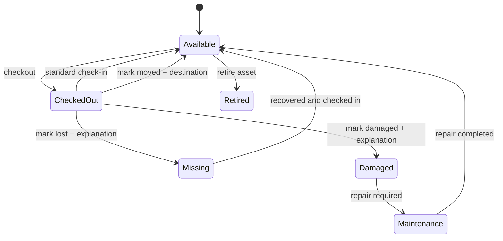
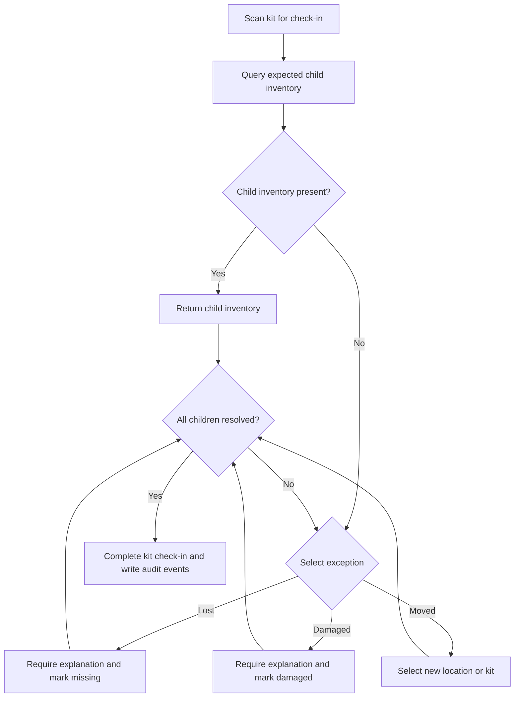
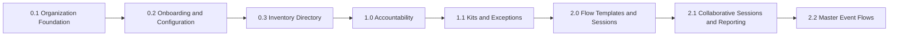
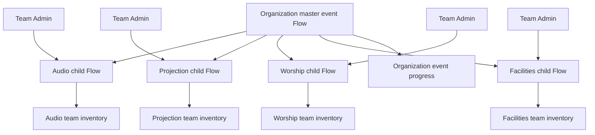

# Product Requirements Document: Quantify

**Planning revision:** 2.3  
**Primary customer for the first release:** Churches  
**Target audience:** Organizations with rapid setup and teardown operations, beginning with church operations teams

## 1. Product Vision

Quantify is a collaborative inventory management system for organizations that prepare, use, and return equipment on a recurring schedule. It gives teams a shared view of what they own, where it is, who has it, and what still needs to be prepared for an operation such as a Sunday service.

The first release optimizes for churches. It supports one organization with multiple teams, both bulk and uniquely tracked inventory, person-based accountability, and online-only operation.

## 2. Product Principles

- Every inventory action belongs to an organization, a team context, and an authenticated user.
- Organization onboarding establishes teams, team categories, and organization locations before inventory is added.
- Cross-team visibility is read-only by default; users cannot check out or check in another team's inventory unless they belong to that team.
- The system must preserve an auditable history of inventory changes and exceptions.
- Bulk catalog items track quantities; uniquely tracked catalog items track individual physical assets.
- A catalog item groups shared information, while an asset represents one physical unit. A uniquely tracked asset may exist before a barcode is assigned; the barcode is optional until the asset is ready for scanning.
- The first release requires network connectivity. Offline scanning is a later roadmap item.
- The first organization administrator is provisioned through a manual approval or support process.

## 3. Current Product Baseline

The existing application provides authenticated access, item CRUD, category and storage-location fields, favourites, stock-level indicators, and transaction history. The planned releases below extend that item-centric foundation into organization-aware inventory operations.

## 4. Organizations, Teams, and Roles

### 4.1 Organization model

An Organization is the top-level tenant, such as `Grace Church`. All users, teams, catalog items, assets, locations, categories, kits, flows, sessions, and audit records belong to an organization. Teams own categories, catalog items, kits, and flows within that organization.

An organization has a static GUID join code. Users may enter the code during signup to request access to the organization and select one or more teams they want to join. The code identifies the organization but does not grant access by itself; organizational approval is still required for full membership.

### 4.2 Team model

A Team is an isolated working group within an organization. Teams may view other teams' inventory, but cross-team access is view-only by default.

Users may belong to multiple teams within an organization. An Organization Admin can create teams and invite members. Team Admins can invite users to their teams. Users can also request to join an organization and a team when they have the organization's join code.

Teams define their own categories for their inventory. Teams also own their kits and Flow templates. A later version may support explicitly shared organization-wide Flow templates, but a flow is team-scoped by default.

Join requests are visible to the Organization Admin and relevant Team Admins. A Team Admin's approval is sufficient to approve the user's team-specific request. Organizational approval is still required before the user becomes a fully active organization member.

### 4.3 Roles

| Role | Organization scope | Default capabilities |
| --- | --- | --- |
| Organization Admin | Entire organization | Manage organization settings, teams, membership, approvals, and permissions; view all inventory and reports; sort organization inventory by team, category, kit, and other fields; cannot edit or transact on inventory unless also a member of its owning team |
| Team Admin | Assigned teams | Manage assigned team membership and team inventory according to organization policy; modify assigned team categories and add organization locations |
| Technician | Assigned teams | View inventory and initiate operational workflows; additional actions are granted by an administrator |
| User | Assigned teams | Read-only access to permitted inventory and locations; additional actions are granted by an administrator |

### 4.4 Permissions

Permissions are granted per user and may extend beyond the role baseline. The initial permission set includes:

- View inventory
- Add item
- Edit item
- Archive item
- Checkout
- Check-in
- Create and manage kits
- Trigger flows
- Manage flow templates
- View reports
- Manage team membership
- Manage organization setup
- Manage team categories
- Manage locations

- Organization Admin inventory access is read-only across teams. An Organization Admin must also belong to an inventory item's owning team to edit, check out, check in, or otherwise transact on that inventory.
- Organization Admin onboarding configuration is administrative setup, not inventory mutation. It allows the Organization Admin to create teams, configure each team's categories, and create organization locations.
- The API must enforce permissions. Hiding a control in the client is not sufficient authorization.

The authorization path applies to every API request. Team membership controls operational scope, while role and per-user permissions control actions within that scope. Organization Admins have organization-wide read and reporting access, but inventory mutations require membership in the owning team.

## 5. Core Entities and Data Rules

The hierarchy is strictly one level: locations cannot contain locations, and kits cannot contain kits.

### Organization

The tenant that owns all data and membership records.

### User

An authenticated account that may belong to multiple teams within an organization. Inventory actions record the acting user.

### Location

A flat physical space such as `Main Closet` or `Stage Left`. Locations belong to the organization and cannot contain another location. Organization Admins create and manage the initial location set. Team Admins may add locations when their team's operations require them; those locations remain organization-owned.

### Category

A team-defined grouping that can define custom fields and required fields for that team's inventory. During onboarding, an Organization Admin can create the initial categories for each team. After a Team Admin is added, they can modify categories for their assigned team and add additional categories. Categories are not shared across teams by default.

### Catalog item

A Catalog Item stores the shared identity and configuration for a class of inventory owned by one team. Examples include `Shure SM58`, `XLR Cable`, or `Folding Chair`.

Required catalog item concepts:

- Name
- Tracking mode: bulk or unique
- Quantity for bulk catalog items
- Category
- Description and shared specifications
- Owning team
- Created and updated timestamps

The catalog item's tracking mode determines how its inventory is represented:

- **Bulk:** The catalog item owns one quantity-based inventory record and does not create individual assets.
- **Unique:** The catalog item owns one asset record for each physical unit.

### Asset

An Asset represents one physical unit belonging to a uniquely tracked catalog item. Each asset has its own internal ID, optional barcode, condition, availability, placement, checkout history, exception history, and audit history. An asset has an effective quantity of one.

An asset may exist without a barcode. When a barcode is assigned, it must be unique within the organization and can be used for scanning. A barcode can only belong to an asset, never directly to a bulk catalog item.

### Inventory counts

For bulk catalog items, the catalog item stores the total quantity and the system reports the available quantity according to its current checkout state. The first release does not support partial quantities: a bulk catalog item is checked out and returned as a whole record. Partial-quantity transactions are deferred.

For unique catalog items, counts are derived from their assets rather than manually entered:

- **Asset count:** Number of active asset records belonging to the catalog item.
- **Available count:** Assets with `Available` status.
- **Checked-out count:** Assets with `Checked Out` status.
- **Exception count:** Assets with `Missing`, `Damaged`, or `Maintenance` status.

For example, seven Shure SM58 microphones are represented by one `Shure SM58` catalog item and seven asset records. The asset count is seven, even if only five assets have barcodes. Each asset can have a different condition, placement, or availability status.

The product rule is: tracking mode is explicit, and a barcode can only belong to a unique asset. The absence of a barcode does not determine whether inventory is bulk or unique.

### Condition and availability status

Condition and availability are separate attributes.

Condition describes physical state: `Excellent`, `Good`, `Fair`, or `Poor`.

Availability describes operational state: `Available`, `Checked Out`, `Missing`, `Damaged`, `Maintenance`, or `Retired`.

### Placement

A bulk catalog item or unique asset is directly placed in exactly one of these locations:

- A Location
- A Kit
- An explicitly recorded exception state when its physical placement is unknown

Inventory cannot be directly assigned to both a location and a kit. A kit itself must be assigned to a location.

An asset's owning team does not have to match the owning team of its current kit. This allows an asset to be moved into another team's kit while retaining the original catalog ownership and audit history.

### Kit

A Kit is a team-owned parent entity that contains items, such as a `Drum Mic Kit`. Kits cannot contain other kits. A kit has both an `organization_id` and a `team_id`, plus a location, condition, availability status, owning team, and audit history.

Checking out a kit checks out the kit and its child inventory as one operation. Returning a kit verifies each expected Asset or bulk Catalog Item and requires resolution for every missing child.

### Flow template

A team-owned saved preset of Catalog Items, Assets, and Kits required for a recurring operation, such as `Sunday Service Setup`. A flow uses inventory available to its owning team. In a later version, an organization may create a master event flow that coordinates team-owned child flows without taking ownership of their inventory.

### Master event Flow (future)

An organization-owned event-level Flow that coordinates multiple team-owned child Flows. For example, a remote camp master Flow can include separate Audio, Projection, Worship, and Facilities child Flows. The master Flow reports overall progress; each child Flow remains editable by its Team Admin and operates within that team's inventory permissions.

### Flow session

An active execution of a Flow template. A session tracks its participants, checklist state, scans, unexpected additions, timestamps, and completion status.

### Session Record

A record created when a Flow session is completed. It records participants, Catalog Items, Assets, and Kits involved, checkout and return actions, timestamps, and all exceptions. The record may be edited for up to one week after the session is closed; every edit is logged, and the record becomes immutable when that window ends.

### Audit record

An append-only record of material changes, including the actor, action, timestamp, affected entity, previous value where relevant, and new value or exception explanation.

### Entity relationships

The core relationships are shown below. A Catalog Item stores shared information, while each Asset represents one physical unit for uniquely tracked inventory. Bulk catalog records and unique assets each have an exclusive placement choice between a Location and a Kit; the database and API must enforce those checks.

## 6. Functional Requirements

### 6.1 Organization and membership

- Provision the first Organization Admin through a manual approval or support process.
- Allow an Organization Admin to create teams.
- Allow an Organization Admin to invite members and Team Admins.
- Allow Team Admins to invite users to their assigned teams.
- Allow a user with a valid organization join code to request organization and team access during signup.
- Show pending membership requests to the Organization Admin and relevant Team Admins.
- A Team Admin's approval is sufficient to approve a team-specific request; organizational approval is still required for full organization membership.
- Record approval, rejection, revocation, and invitation events in the audit history.
- Prevent a user from accessing data outside their organization.

### 6.2 Organization onboarding and configuration

- Provide an onboarding workspace for the Organization Admin after the organization is provisioned.
- Allow the Organization Admin to create teams and assign or invite Team Admins.
- Allow the Organization Admin to configure categories separately for each team, including custom fields and required fields.
- Allow the Organization Admin to create the initial organization-wide locations.
- Show the Organization Admin which teams, categories, and locations have been configured and which setup areas remain incomplete.
- Allow onboarding configuration to be completed in stages without requiring all teams to be configured at once.
- When a Team Admin is added, give them access to maintain categories for their assigned team, including modifying categories created during onboarding and adding new categories.
- Allow Team Admins to add locations when their team's operations require them. Added locations remain owned by the organization and visible according to organization access rules.
- Preserve the creator, modifier, timestamps, and audit history for onboarding configuration changes.
- Do not allow a Team Admin to modify another team's categories through the onboarding or configuration experience.

### 6.3 Inventory directory

- Search Catalog Items, Assets, Kits, and Locations.
- Filter by name, team, category, location, tracking mode, condition, availability, and date added.
- Display cross-team inventory as view-only. A user cannot check out or check in another team's inventory unless they are a member of that team.
- Create, edit, archive, and restore Catalog Items and Assets according to permissions.
- Enforce team-defined category custom fields and required fields.
- Calculate stock and availability status on the backend.
- Derive unique-inventory counts from active Asset records, including total, available, checked-out, and exception counts.
- Preserve archived records in historical transactions and Session Records.
- When a location or category is archived, regroup affected Catalog Items and Assets under the appropriate system-managed `Unknown` location or category while preserving their history.

### 6.4 Barcodes and scanning

- Generate a printable barcode for each uniquely tracked Asset when the team is ready to label it.
- Allow a uniquely tracked asset to exist without a barcode until one is assigned.
- Support camera scanning in the web application.
- Support manual barcode entry when camera scanning is unavailable.
- Provide auditory or visual confirmation after a successful scan.
- Resolve a scanned barcode to exactly one Asset.
- Reject scans for retired, unknown, or unauthorized assets with an actionable message.

### 6.5 Checkout and check-in

- Associate every checkout with an authenticated person.
- Allow a bulk Catalog Item to be checked out and returned as a whole inventory record; partial quantities are deferred.
- Allow unique Assets to be checked out and returned individually.
- Prevent checkout when the requested inventory is unavailable.
- Record who performed the action, who holds the inventory, what changed, and when it changed.
- Do not require an expected return date in the first release.
- Handle competing checkout and checkin attempts atomically so an Asset or bulk Catalog Item cannot be checked out twice.
- Checkout and checkins must display error messages if there is a conflict and another person already scanned the item in.
- Require team membership for checkout and check-in; organization-wide visibility does not grant operational access.

If a kit contains unavailable child inventory, the user may continue with a partial kit checkout only after explicitly acknowledging which Assets or bulk Catalog Items were not checked out. The system must notify the Organization Admin and relevant Team Admin, and must record the acknowledgment and notification in the audit history.

#### Partial kit checkout

When a kit is checked in, the system queries its expected child inventory. Every missing child must be resolved as one of the following:

- **Lost:** Requires a written explanation.
- **Damaged:** Requires a written explanation and updates the item's availability status.
- **Moved:** Requires a new Location or Kit destination.

The system must retain the original checkout, the return attempt, and each exception in the audit history.

#### Availability lifecycle

The lifecycle applies to unique assets and kits. Bulk inventory uses the same availability concepts while also tracking the quantity remaining after each transaction.

#### Kit return resolution

### 6.6 Kits

- Assign every kit to exactly one owning team.
- Create a kit and assign it to a location.
- Add and remove unique Assets or whole bulk Catalog Items from a kit according to permissions.
- Prevent kits from containing other kits.
- Ensure an Asset or bulk Catalog Item has only one direct placement.
- Show child Asset and bulk Catalog Item condition and availability before checkout.
- Allow a partial kit checkout after explicit acknowledgment when child inventory is already unavailable, and notify the Organization Admin and relevant Team Admin.
- Check out and return a kit as a single user operation while retaining Asset and bulk Catalog Item history.

### 6.7 Flow sessions

The initial Flow release is single-operator, online-only, and team-scoped. A Flow template belongs to exactly one team and may reference that team's inventory. Organization-wide master flows are deferred until explicit sharing rules are defined.

The initial Flow release includes:

- Create and edit reusable Flow templates.
- Start a session from a Flow template.
- Show required Catalog Items, Assets, and Kits grouped by category.
- Mark expected inventory as scanned or pending.
- Automatically append an authorized Asset or bulk Catalog Item scanned outside the original template.
- Complete or cancel a session with a reason.
- Generate a Session Record on completion. The record remains editable for up to one week after the session is closed; every edit is logged, after which the record becomes immutable.

Collaborative participation, push notifications, real-time synchronization, and live avatars are later releases. The design must leave room for them without making them prerequisites for the first Flow implementation.

### 6.8 Reporting and analytics

Initial reporting should include:

- Current active checkouts by person and team.
- Pending membership requests.
- Missing and damaged inventory.
- Recent checkout, check-in, and exception history.
- Printable or shareable checkout checklists.

Later reporting may include frequently used items, utilization rates, stock trends, and service-level preparation metrics.

## 7. Key Views

- **Dashboard:** Prioritize active checkouts and pending membership requests, followed by missing or damaged items, recent activity, and active Flow sessions.
- **Organization Onboarding:** Guided setup for teams, team categories, organization locations, Team Admin handoff, and setup completion status.
- **Inventory Directory:** Searchable and filterable Catalog Items, Assets, Kits, and Locations with clear tracking and ownership state.
- **Catalog Item, Asset, or Kit Detail:** Shared catalog information, asset counts, placement, condition, availability, current holder, barcode, child inventory, and audit history.
- **Members and Teams:** Teams, invitations, join requests, roles, and per-user permissions.
- **Roles and Permissions:** Administrative matrix for granting capabilities to individuals.
- **Scanner View:** Camera-first scanning with manual entry fallback and clear success or error feedback.
- **Checkout View:** Selected person, scanned inventory, quantities, and confirmation before committing the operation.
- **Check-in View:** Expected returns and exception resolution for missing, damaged, or moved inventory.
- **Flow Board:** Required, scanned, pending, and appended inventory for the active session.
- **Reports:** Active checkout, exception, and historical session views with print or share actions.

## 8. Versioned Delivery Outline

Each release builds on the authorization, data, and audit guarantees established by the previous release. The sequence establishes organization setup before inventory operations, and keeps real-time collaboration, organization-wide event orchestration, and offline reconciliation out of the foundation work.

### Version 0.1: Organization Foundation

**Goal:** Establish secure organization and team boundaries before expanding inventory operations.

**Includes:**

- Organization and team entities.
- Manual first-admin provisioning.
- Organization join code.
- Invitations and membership requests.
- Organization Admin and Team Admin roles.
- Organization approval plus Team Admin approval for team-specific requests.
- Approval, rejection, and revocation states.
- Organization and team authorization at the API layer.
- Basic member and team management views.

**Exit criteria:** A user can belong to the correct organization and teams, see only authorized data, and receive the correct read-only or administrative capabilities.

### Version 0.2: Onboarding and Organization Configuration

**Goal:** Give an Organization Admin a complete first-time setup path before teams begin adding inventory.

**Includes:**

- An onboarding workspace available after organization provisioning.
- Team creation and Team Admin assignment or invitation.
- Per-team category configuration, including custom and required fields.
- Initial organization-wide location setup.
- A setup summary showing configured and incomplete teams, categories, and locations.
- Staged onboarding so configuration can be completed over multiple visits.
- Team Admin handoff for assigned-team category maintenance.
- Team Admin ability to add organization locations required by team operations.
- Audit history for setup changes.
- Authorization that prevents a Team Admin from modifying another team's categories.

**Exit criteria:** An Organization Admin can establish the organization's teams, initial categories, and locations, and a Team Admin can maintain their assigned team's categories and add needed locations without accessing another team's configuration.

### Version 0.3: Inventory Directory

**Goal:** Make the inventory trustworthy and usable for church teams.

**Includes:**

- Locations and categories.
- Catalog Items with bulk or unique tracking modes.
- Asset records for every physical unit of a uniquely tracked Catalog Item.
- Condition and availability fields.
- Search and filtering.
- Team-defined category custom fields.
- Add, edit, archive, and restore workflows.
- Backend stock and status calculation.
- Team-defined categories and system-managed `Unknown` regrouping for archived categories or locations.
- Cross-team view-only behavior with no cross-team checkout or check-in.
- Audit history for inventory changes.

**Exit criteria:** Teams can maintain a complete organization inventory and understand what exists, where it is, who owns it, and whether it is available.

### Version 1.0: Accountability

**Goal:** Track who has inventory and prevent double allocation.

**Includes:**

- Barcode generation and printing.
- Camera scanning and manual barcode entry.
- Person-based checkout and check-in.
- Whole-record bulk Catalog Item checkout; partial quantities are deferred.
- Individual Asset checkout.
- Unique Assets may be created before a barcode is assigned.
- Derived Catalog Item asset counts and availability counts.
- Current-holder views.
- Atomic availability updates.
- Detailed transaction and audit records.

**Explicitly deferred:** Required return dates, offline operation, reservations, and hardware scanner integrations.

### Version 1.1: Kits and Exceptions

**Goal:** Support recurring equipment packages without losing item-level accountability.

**Includes:**

- One-level kits owned by teams and assigned to locations.
- Child-Asset and whole bulk Catalog Item management.
- Kit checkout and return.
- Acknowledged partial kit checkout when child inventory is unavailable, with Admin notification.
- Strict missing-item resolution.
- Lost, damaged, and moved exceptions.
- Item and kit audit history.

**Exit criteria:** A team can prepare, check out, return, and reconcile a kit while explaining every missing or changed child item.

### Version 2.0: Flow Templates and Sessions

**Goal:** Turn recurring setup work into a repeatable checklist.

**Includes:**

- Team-owned Flow templates containing Catalog Items, Assets, and Kits.
- Single-operator Flow sessions.
- Grouped checklist view.
- Scan-to-complete behavior.
- Auto-append for unexpected authorized inventory.
- Complete and cancel actions.
- Session Records editable for one week after closure, with every edit logged, then immutable.

### Version 2.1: Collaborative Sessions and Reporting

**Goal:** Let multiple team members prepare together and measure operational reliability.

**Includes:**

- Opt-in participation for active team members.
- In-app notifications and banners.
- Multiple simultaneous participants.
- Real-time checklist synchronization.
- Presence indicators and participant avatars.
- Printable and shareable session checklists.
- Utilization, checkout, lost, and damaged reports.

### Version 2.2: Master Event Flows

**Goal:** Coordinate multiple team-owned flows under one organization-wide event without taking inventory ownership away from teams.

**Includes:**

- Organization-owned master event flows.
- Team-owned child flows for teams such as Audio, Projection, Worship, and Facilities.
- Team Admin editing of their team's child flow.
- Organization-level visibility into child-flow progress.
- Separate team checkout operations for each child flow.
- A master event session that summarizes the child sessions without bypassing team permissions.

**Example:** A remote camp master flow can include an Audio child flow for microphones, a Projection child flow for displays, a Worship child flow for instruments, and a Facilities child flow for equipment. Each Team Admin maintains the items in their own child flow while the organization tracks the event as a whole.

### Later roadmap

- Reservations and bookings for flows, kits, and unique assets.
- Additional organization-level event coordination beyond the first master and child Flow model.
- Offline scan queue and conflict reconciliation.
- Offline-first scanning for unreliable connectivity.
- Bluetooth and USB hardware scanner support.
- Required expected return dates and overdue workflows.
- Advanced notification channels.
- Custom permission presets and temporary permissions.
- Cross-organization membership.

## 9. Product Decisions and Remaining Clarification

### 9.1 Confirmed decisions

- A user cannot check out or check in another team's inventory unless they are a member of that team.
- A Team Admin's approval is sufficient for the team-specific portion of a join request. Organization approval is still required for full organization membership.
- Organization Admins can manage organization settings, teams, membership, approvals, permissions, and reports. They can view and sort all organization inventory, but cannot edit or transact on an item's inventory unless they also belong to that item's owning team.
- The organization join code is a static GUID. It identifies the organization but does not grant access without the required organizational approval.
- A uniquely tracked Asset may exist without a barcode. A barcode can be assigned later.
- Inventory uses a Catalog Item and Asset model. One Catalog Item stores shared information; each physical unit of a uniquely tracked Catalog Item is represented by one Asset record.
- Seven Shure SM58 microphones are represented by one `Shure SM58` Catalog Item and seven Asset records. The Asset count is seven, even if some assets do not have barcodes yet.
- Asset counts are derived from active Asset records. Bulk Catalog Items store a quantity and do not create individual Asset records.
- The first release does not support partial quantities for bulk inventory. Bulk Catalog Items are checked out and returned as whole records; partial-quantity transactions are deferred.
- An Asset may be moved into a kit owned by another team. The Asset retains its Catalog Item ownership while the kit retains its own `organization_id` and `team_id`.
- When a location or team-defined category is archived, affected Catalog Items and Assets are regrouped under the appropriate system-managed `Unknown` location or category. Historical records retain the original reference.
- If a kit contains unavailable child inventory, the user may acknowledge a partial checkout. Available inventory is checked out, unavailable inventory is recorded, and the Organization Admin and relevant Team Admin are notified.
- The first dashboard priorities are active checkouts and pending membership requests.
- A closed Flow Session can be edited for up to one week. Every edit is logged, and the Session Record becomes immutable after the edit window.
- Flow templates are team-owned for now. A future organization-owned master event Flow may coordinate editable child Flows owned by individual teams.

### 9.2 Approved catalog and asset model

Quantify uses a Catalog Item and Asset model for inventory. The Catalog Item stores shared information such as name, category, tracking mode, description, and owning team. Assets store physical-unit information such as barcode, condition, placement, availability, and history.

For seven Shure SM58 microphones:

- Create one Catalog Item named `Shure SM58`.
- Create seven Asset records beneath that Catalog Item.
- Assign each Asset an internal ID. Assign a barcode when the physical microphone is labeled; the barcode remains optional during initial setup.
- Calculate `Asset count = 7` from the seven active Asset records.
- Calculate available, checked-out, damaged, missing, and maintenance counts from each Asset's current status.

The Catalog Item count is a summary of its Assets, not a second manually maintained quantity. This prevents the catalog total from diverging from the physical asset records.

Bulk inventory uses the same Catalog Item entity with `tracking_mode = Bulk`, stores a quantity directly on the Catalog Item, and creates no Asset records. The first release checks out a bulk Catalog Item as a whole record; partial quantities remain deferred.

### 9.3 Future Flow structure

The planned organization-level Flow model is intentionally different from simply making every team Flow visible to everyone:

The organization creates and monitors the master event Flow. Each Team Admin edits only that team's child Flow, and each team performs checkout against inventory it is authorized to transact on. The master event summarizes progress without bypassing team ownership or permissions.
